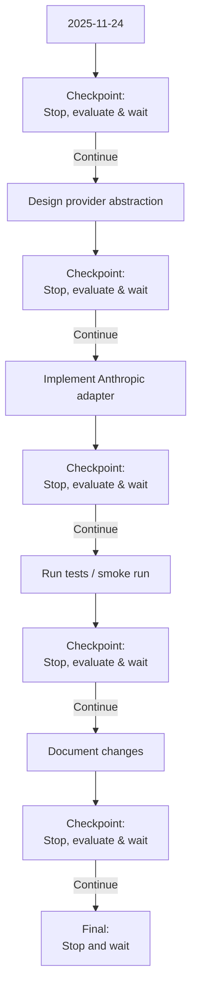

## FinAgy TODO Workflow

The following diagram shows the planned workflow with checkpoints after each major step.

You can preview by paste the Mermaid block into https://mermaid.live to render it.
